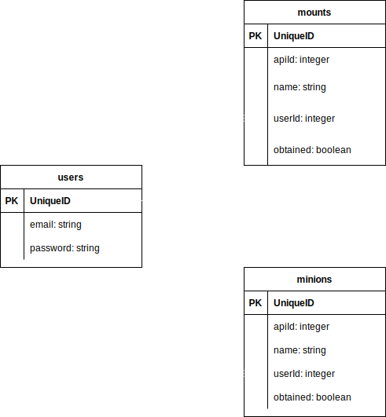
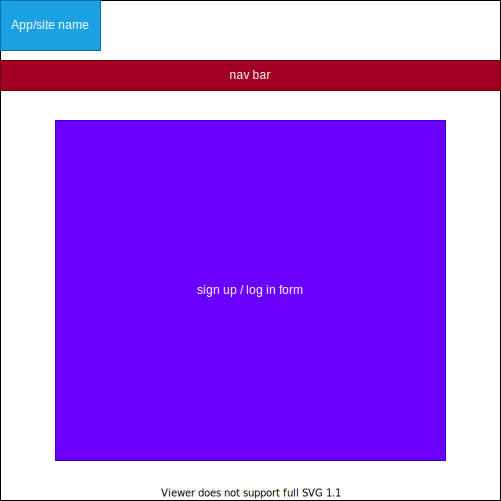
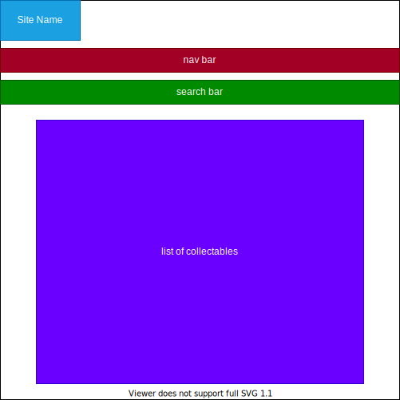
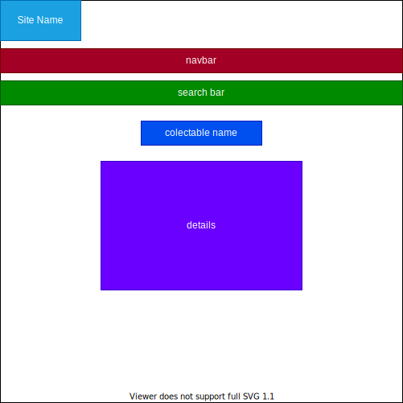
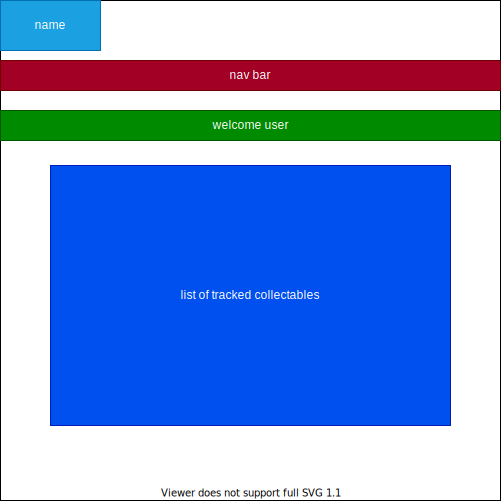

# FFXIV Collection Tracker

Website where you can search for and view various collectables in the MMORPG Final Fantasy XIV Online. By creating an account, users can also add collectables to a list and mark them as obtained or unobtained. Users can view their list on their profile page for easier tracking of all the goodies they want to get.

## API
https://ffxivcollect.com/

https://ffxivcollect.com/api/docs

API that provides data on all (if not most) of the collectables in the game. No API key is needed and there doesn't seem to be any form of rate limiting. Will mostly be using the API to get and show data on the collectables (ex. names, descriptions, and how to get them).

## ERD
My database feels very simple but I don't think theres any more data I really need to store as of now

## RESTful Routing Chart
| VERB | URL | ACTION | DESCRIPTION |
|------|-----|--------|-------------|
| GET | /users/new | READ | display a sign up form
| POST | /users | CREATE | create a new user in the DB
| GET | /users/login | READ | display a login form
| POST | /users/login | CREATE? | log in the user and save them in a cookie
| GET | /users/:id | READ | display the logged in user's profile page
| GET | /users/logout | READ? | logout the user
| GET | /mounts | READ | mount index
| GET | /mounts/:id | READ | show page for specific mount
| GET | /minions | READ | minion index
| GET | /minions/:id | READ | show page for specific minion
| POST | /users/:id/mounts | CREATE | add mount to user's list
| PUT | /users/:id/mounts/:id | UPDATE | mark mount as obtained or not
| DELETE | /users/:id/mounts/:id | DESTROY | remove mount from list
| POST | /users/:id/minions | CREATE | add minion to user's list
| PUT | /users/:id/minions/:id | UPDATE | mark minion as obtained or not
| DELETE | /users/:id/minions/:id | DESTROY | remove minion from list

More routes can be added for extra categories I add to the DB

## Wireframes
### forms

### indexes

### show

### user profile

## User Stories
- As a user, I want to view all the collectables in a category
- As a user, I want to search for collectables in a category
- As a user, I want to view details on a specific collectable
- As a user, I want to add certain collectables to my personal list
- As a user, I want to mark collectables I have as obtained in my list
- As a user, I want to remove collectables from my list that I no longer want to track

## MVP / Stretch Goals
### MVP
- [] Display an index page for each collectable category (mounts and minions for now)
- [] Allow users to search for collectables by name within each category
- [] Display a show page with details on a specific colelctable
- [] Let users create accounts and log in with them (with secured auth)
- [] Let users add collectables to their personal track list
- [] Let users mark those collectables as obtained or not
- [] Let users remove collectables from their track list

### Stretch
- [] Add more collectable categories (the api provides data on around 15 different categories)
- [] Give users the ability to search through their personal lists
- [] Allow users to track multiple characters (players can have multiple characters which have unique collection progress)
- [] 